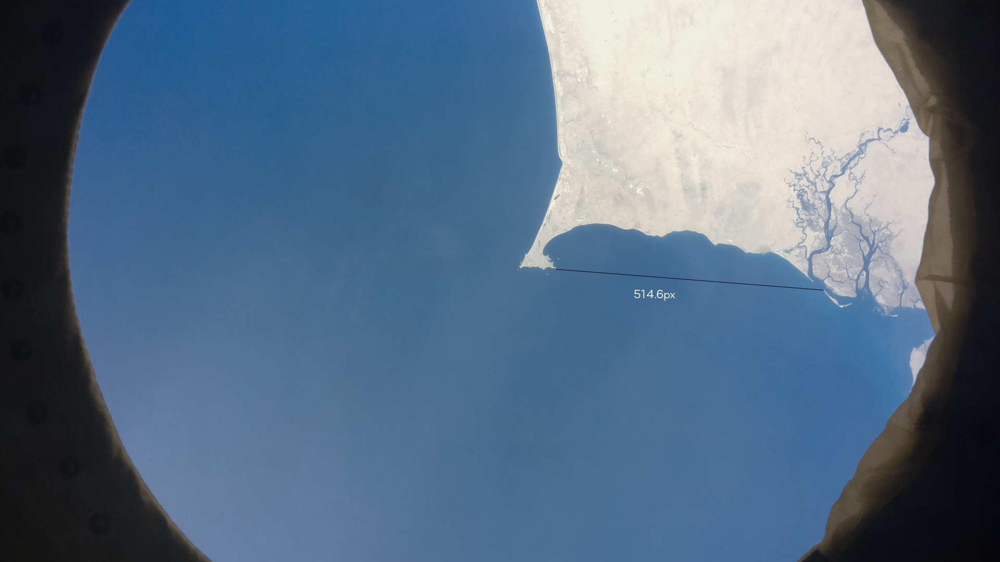
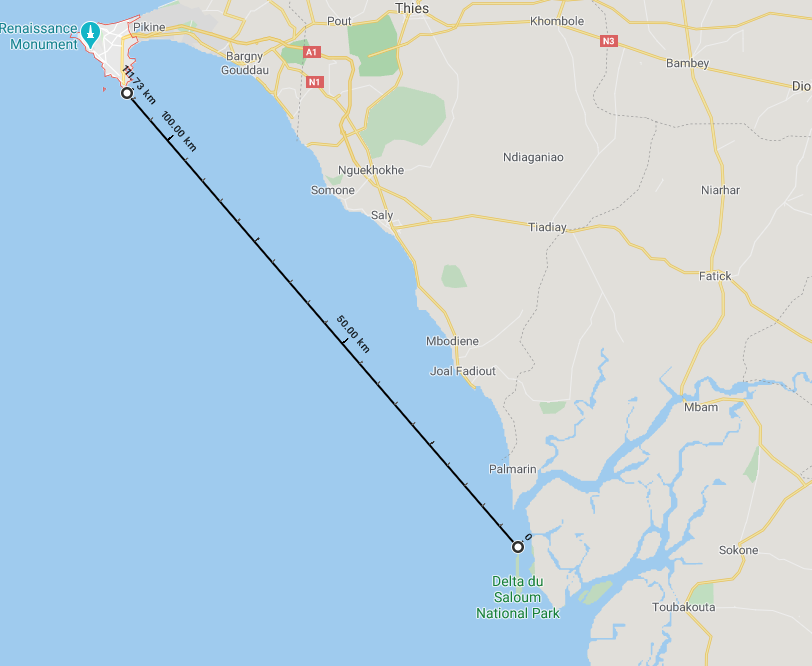

#Distance references

The FOV of the camera was unknown so there for I had to find an alternative solution when finding the scale of the images.
One of the most obvious and large land marks the Dakar peninsular. Using Google Maps to find the distance between the most southern part of the outcrop to the most northern tip of the island containing Delta du Saloum National Park.

The distance in pixels between the two is 514.6px and the distance in kilometres in 111.73km.

Therefore 0.21712km per pixel.

111.32km in 1 degree.

##Therefore 1px must be equal to 0.01950 degrees (In decimal format)
